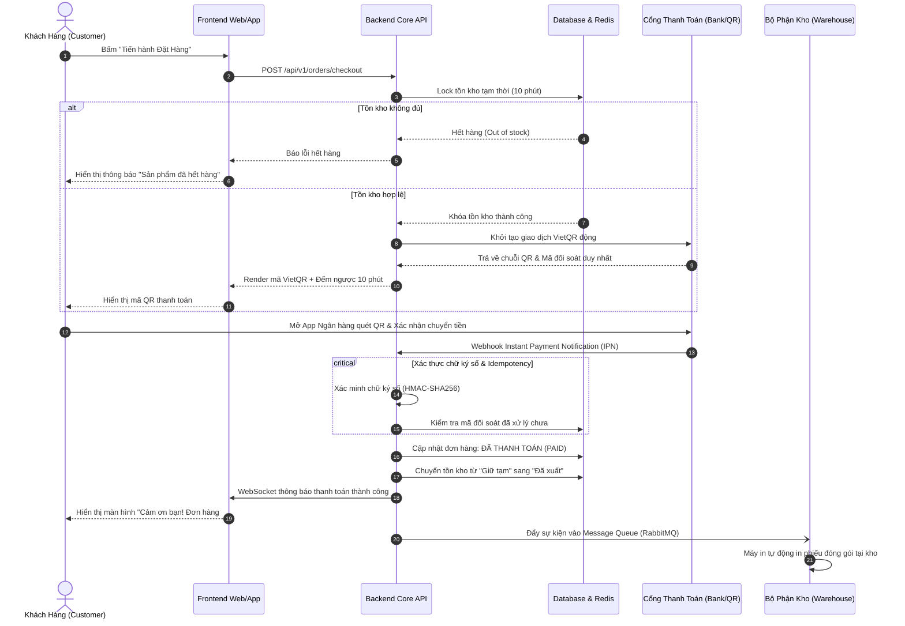

# SƠ ĐỒ QUY TRÌNH NGHIỆP VỤ XỬ LÝ ĐƠN HÀNG (BPMN / FLOWCHART)

```mermaid
sequenceDiagram
    autonumber
    actor C as Khách Hàng (Customer)
    participant FE as Frontend Web/App
    participant BE as Backend Core API
    participant DB as Database & Redis
    participant PG as Cổng Thanh Toán (Bank/QR)
    participant W as Bộ Phận Kho (Warehouse)

    C->>FE: Bấm "Tiến hành Đặt Hàng"
    FE->>BE: POST /api/v1/orders/checkout
    BE->>DB: Lock tồn kho tạm thời (10 phút)
    alt Tồn kho không đủ
        DB-->>BE: Hết hàng (Out of stock)
        BE-->>FE: Báo lỗi hết hàng
        FE-->>C: Hiển thị thông báo "Sản phẩm đã hết hàng"
    else Tồn kho hợp lệ
        DB-->>BE: Khóa tồn kho thành công
        BE->>PG: Khởi tạo giao dịch VietQR động
        PG-->>BE: Trả về chuỗi QR & Mã đối soát duy nhất
        BE-->>FE: Render mã VietQR + Đếm ngược 10 phút
        FE-->>C: Hiển thị mã QR thanh toán
    end

    C->>PG: Mở App Ngân hàng quét QR & Xác nhận chuyển tiền
    PG->>BE: Webhook Instant Payment Notification (IPN)
    
    critical Xác thực chữ ký số & Idempotency
        BE->>BE: Xác minh chữ ký số (HMAC-SHA256)
        BE->>DB: Kiểm tra mã đối soát đã xử lý chưa
    end

    BE->>DB: Cập nhật đơn hàng: ĐÃ THANH TOÁN (PAID)
    BE->>DB: Chuyển tồn kho từ "Giữ tạm" sang "Đã xuất"
    BE->>FE: WebSocket thông báo thanh toán thành công
    FE-->>C: Hiển thị màn hình "Cảm ơn bạn! Đơn hàng #12345 đã xác nhận"
    
    BE-)W: Đẩy sự kiện vào Message Queue (RabbitMQ)
    W->>W: Máy in tự động in phiếu đóng gói tại kho
```

