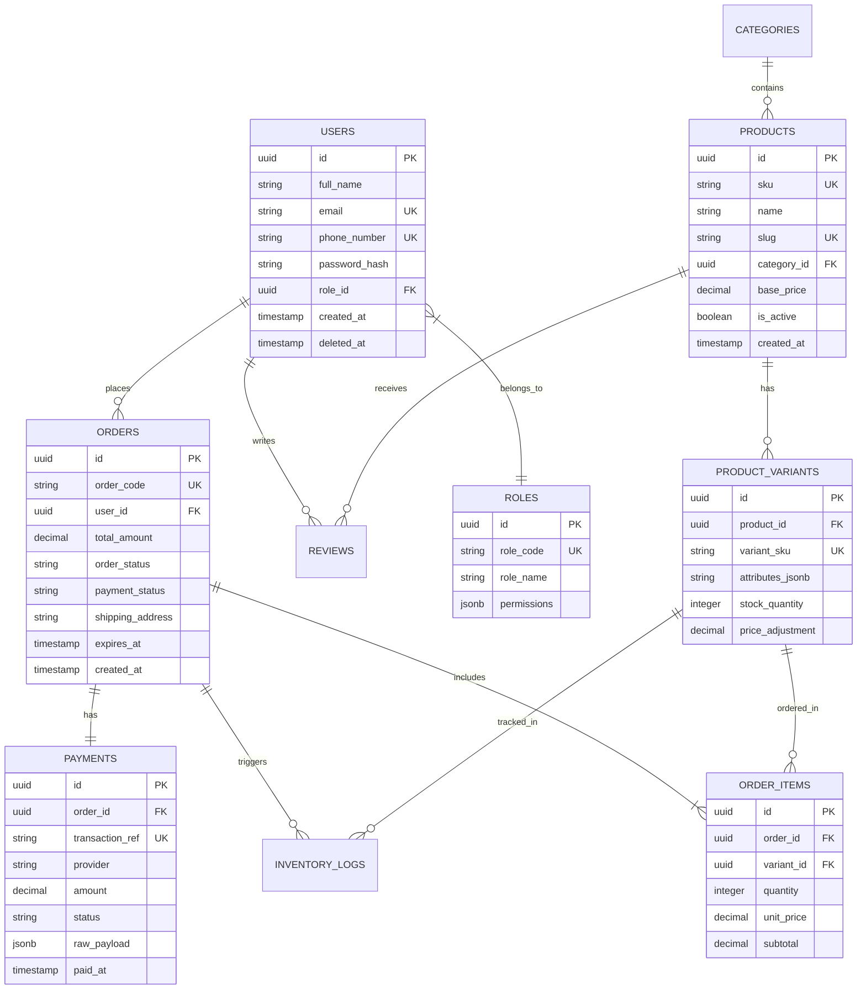

# SƠ ĐỒ QUAN HỆ THỰC THỂ CƠ SỞ DỮ LIỆU (ENTITY RELATIONSHIP DIAGRAM - ERD)

```mermaid
erDiagram
    USERS ||--o{ ORDERS : "places"
    USERS ||--o{ REVIEWS : "writes"
    USERS }|--|| ROLES : "belongs_to"
    
    CATEGORIES ||--o{ PRODUCTS : "contains"
    PRODUCTS ||--o{ PRODUCT_VARIANTS : "has"
    PRODUCTS ||--o{ REVIEWS : "receives"
    
    ORDERS ||--|{ ORDER_ITEMS : "includes"
    ORDERS ||--|| PAYMENTS : "has"
    ORDERS ||--o{ INVENTORY_LOGS : "triggers"
    
    PRODUCT_VARIANTS ||--o{ ORDER_ITEMS : "ordered_in"
    PRODUCT_VARIANTS ||--o{ INVENTORY_LOGS : "tracked_in"

    USERS {
        uuid id PK
        string full_name
        string email UK
        string phone_number UK
        string password_hash
        uuid role_id FK
        timestamp created_at
        timestamp deleted_at
    }

    ROLES {
        uuid id PK
        string role_code UK
        string role_name
        jsonb permissions
    }

    PRODUCTS {
        uuid id PK
        string sku UK
        string name
        string slug UK
        uuid category_id FK
        decimal base_price
        boolean is_active
        timestamp created_at
    }

    PRODUCT_VARIANTS {
        uuid id PK
        uuid product_id FK
        string variant_sku UK
        string attributes_jsonb
        integer stock_quantity
        decimal price_adjustment
    }

    ORDERS {
        uuid id PK
        string order_code UK
        uuid user_id FK
        decimal total_amount
        string order_status
        string payment_status
        string shipping_address
        timestamp expires_at
        timestamp created_at
    }

    ORDER_ITEMS {
        uuid id PK
        uuid order_id FK
        uuid variant_id FK
        integer quantity
        decimal unit_price
        decimal subtotal
    }

    PAYMENTS {
        uuid id PK
        uuid order_id FK
        string transaction_ref UK
        string provider
        decimal amount
        string status
        jsonb raw_payload
        timestamp paid_at
    }
```

